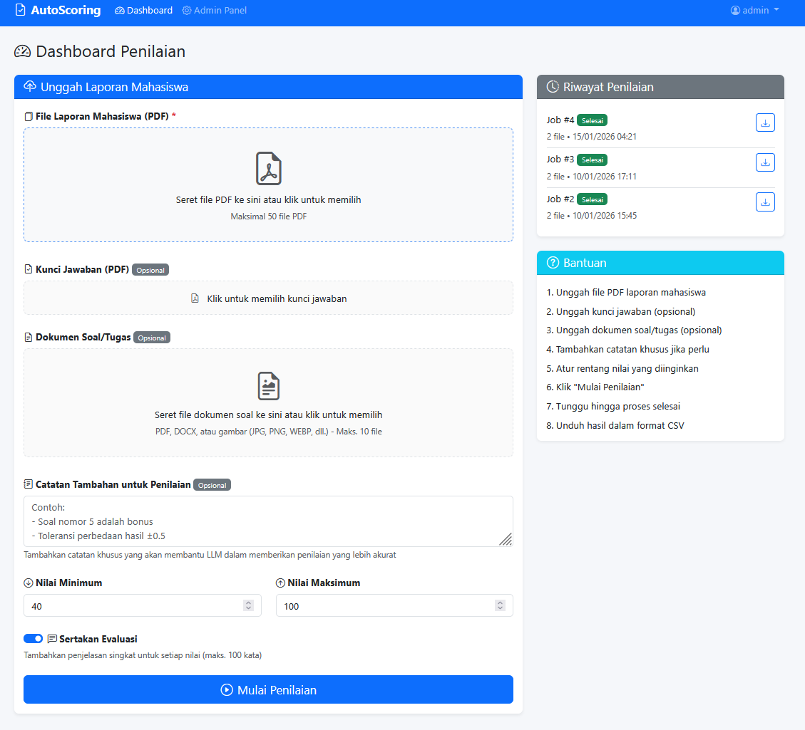

# AutoScoring
<h3 align="center">Sistem Penilaian Otomatis Laporan Praktikum Mahasiswa</h3>

<p align="center">
  <strong>Lab FKI Universitas Muhammadiyah Surakarta</strong><br>
  Program Studi Informatika
</p>

---

## 📸 Demo Aplikasi

<p align="center">
  
</p>

<p align="center"><em>Dashboard Penilaian AutoScoring - Upload laporan, atur parameter, dan mulai penilaian otomatis</em></p>

### Alur Kerja Sistem

<p align="center">
  
</p>

<p align="center"><em>Diagram alur kerja sistem AutoScoring - dari upload hingga export hasil</em></p>

---

## 📖 Tentang AutoScoring

AutoScoring adalah aplikasi web berbasis Flask yang membantu dosen dan asisten laboratorium untuk menilai laporan praktikum atau tugas mahasiswa secara otomatis menggunakan Large Language Model (LLM). Mendukung multi-provider: Google Gemini, NVIDIA Build, OpenAI, DeepSeek, OpenRouter, SiliconFlow, dan GitHub Models — dapat dipilih melalui Admin Panel.

### Mengapa AutoScoring?

| Masalah Tradisional | Solusi AutoScoring |
|---------------------|-------------------|
| ⏱️ Penilaian manual memakan waktu 2-3 menit per laporan | ⚡ Penilaian otomatis dalam hitungan detik |
| 😓 Inkonsistensi akibat kelelahan penilai | 🎯 Konsistensi penilaian dengan standar yang sama |
| 📅 Keterlambatan umpan balik ke mahasiswa | 📊 Hasil instan dalam format CSV |
| 💰 Biaya langganan platform grading mahal | 🆓 Self-hosted, gratis, data tetap di institusi |

---

## ✨ Fitur Utama

| Fitur | Deskripsi |
|-------|-----------|
| 🚀 **Mode Dual: Bulk & Single** | Pilih antara penilaian massal (hingga 50 file) atau per mahasiswa |
| 📄 **Ekstraksi Otomatis** | NIM dan Nama mahasiswa diekstrak otomatis dari dokumen oleh AI |
| 📷 **Kamera Capture** | Ambil foto jawaban mahasiswa langsung dari webcam/kamera HP |
| 🛑 **Real-time Status** | Pantau status (Waiting, Processing, Completed) per mahasiswa secara real-time |
| 🛡️ **Failsafe System** | Penanganan otomatis jika NIM/Nama tidak terbaca (ditandai `[Tidak Terbaca]`) |
| 📂 **Format Fleksibel** | Dukungan teks (TXT, MD) dan gambar untuk soal/kunci jawaban |
| 🔑 **Kunci Jawaban & Soal** | Upload kunci jawaban dan soal sebagai referensi penilaian (wajib min. 1) |
| 💬 **Catatan Tambahan** | Instruksi khusus untuk panduan penilaian LLM |
| 🤖 **Multi-Provider AI** | Google Gemini, NVIDIA Build, OpenAI, DeepSeek, OpenRouter, SiliconFlow, dan GitHub Models — pilih via Admin Panel |
| 📊 **Export CSV** | Hasil penilaian lengkap dalam format CSV |
| 🔄 **Round-Robin API** | Rotasi hingga 20 API key Gemini untuk menghindari rate limit |
| 🖥️ **GPU Acceleration** | Akselerasi GPU untuk parsing dokumen dengan Docling + EasyOCR |
| 🔒 **Role Management** | Sistem login aman dengan role Admin dan Aslab |
| ⚙️ **Admin Panel** | Manajemen pengguna, statistik, dan pengaturan runtime |

---

## 🛠️ Teknologi

| Komponen | Teknologi |
|----------|-----------|
| Backend | Flask 3.0+, SQLAlchemy, Flask-Login, Flask-Admin |
| PDF Parser | Docling (IBM), EasyOCR |
| AI/LLM | Google Gemini, NVIDIA Build, OpenAI, DeepSeek, OpenRouter, SiliconFlow, GitHub Models (multi-provider) |
| Database | SQLite3 |
| Frontend | Bootstrap 5, Dropzone.js |
| Deployment | Docker (GPU/CPU), Gunicorn |

---

## 📋 Persyaratan Sistem

### Minimum (CPU Only)
- Python 3.10+
- 4GB RAM
- 10GB Disk Space

### Rekomendasi (GPU Enabled)
- Python 3.11
- 8GB+ RAM
- NVIDIA GPU dengan CUDA 12.1+
- NVIDIA Container Toolkit (untuk Docker)

---

## 🚀 Instalasi & Deployment

### 🐳 Metode 1: Docker (Direkomendasikan)

#### Opsi A: Versi GPU (Tercepat & Terbaik)
Gunakan opsi ini jika mesin Anda memiliki NVIDIA GPU.

1.  **Prasyarat**: Pastikan NVIDIA Container Toolkit terinstall.
    ```bash
    # Cek instalasi
    nvidia-smi
    ```
2.  **Konfigurasi Environment**:
    ```bash
    cp .env.example .env
    # Edit .env dan isi API key Gemini
    ```
3.  **Jalankan dengan Docker Compose**:
    ```bash
    docker-compose up -d --build
    ```
   *Aplikasi akan berjalan di port 5005.*

#### Opsi B: Versi CPU Only (Kompatibilitas Luas)
Gunakan opsi ini jika tidak memiliki GPU khusus.

1.  **Konfigurasi Environment**:
    ```bash
    cp .env.example .env
    # Edit .env dan isi API key Gemini
    ```
2.  **Jalankan dengan Docker Compose CPU**:
    ```bash
    docker-compose -f docker-compose.cpu.yml up -d --build
    ```
   *Aplikasi akan berjalan di port 5005.*

---

### 💻 Metode 2: Instalasi Manual (Lokal)

1. **Clone repository**
   ```bash
   git clone https://github.com/your-repo/autoscoring.git
   cd autoscoring
   ```

2. **Buat virtual environment**
   ```bash
   python -m venv venv
   
   # Windows
   venv\Scripts\activate
   
   # Linux/Mac
   source venv/bin/activate
   ```

3. **Install dependencies**
   ```bash
   pip install -r requirements.txt
   ```

4. **Konfigurasi environment**
   ```bash
   cp .env.example .env
   # Edit .env dan isi API key Gemini
   ```

5. **Jalankan aplikasi**
   ```bash
   python run.py
   ```

6. **Akses aplikasi**
   - Buka browser: http://localhost:5005

---

## ⚙️ Konfigurasi

### LLM Provider

AutoScoring mendukung 7 provider LLM. Konfigurasi awal via `.env`, selanjutnya dapat diubah melalui **Admin Panel > Pengaturan LLM**.

| Provider | Default Model | Cara Dapat API Key |
|----------|--------------|--------------------|
| Google Gemini | `gemini-2.5-flash` | [Google AI Studio](https://aistudio.google.com/app/apikey) |
| NVIDIA Build | `moonshotai/kimi-k2.5` | [NVIDIA Build](https://build.nvidia.com) |
| OpenAI | `gpt-4.1` | [OpenAI Platform](https://platform.openai.com/api-keys) |
| DeepSeek | `deepseek-chat` | [DeepSeek Platform](https://platform.deepseek.com/api_keys) |
| OpenRouter | `openai/gpt-4o-mini` | [OpenRouter](https://openrouter.ai/keys) |
| SiliconFlow | `Qwen/Qwen2.5-72B-Instruct` | [SiliconFlow](https://siliconflow.cn) |
| GitHub Models | `openai/gpt-4.1-mini` | [GitHub Models](https://github.com/marketplace/models) |

Konfigurasi `.env`:
```
LLM_PROVIDER=gemini
LLM_MODEL=gemini-2.5-flash

# Gemini (dukung hingga 20 key round-robin)
GEMINI_API_KEY_1=your-key
GEMINI_API_KEY_2=your-second-key

# NVIDIA Build
NVIDIA_API_KEY=nvapi-...
NVIDIA_BASE_URL=https://integrate.api.nvidia.com/v1

# OpenAI
OPENAI_API_KEY=sk-...
OPENAI_BASE_URL=https://api.openai.com/v1

# DeepSeek
DEEPSEEK_API_KEY=sk-...
DEEPSEEK_BASE_URL=https://api.deepseek.com/v1

# OpenRouter
OPENROUTER_API_KEY=sk-or-...
OPENROUTER_BASE_URL=https://openrouter.ai/api/v1

# SiliconFlow
SILICONFLOW_API_KEY=sk-...
SILICONFLOW_BASE_URL=https://api.siliconflow.cn/v1

# GitHub Models
GITHUB_API_KEY=ghp_... atau github_pat_...
GITHUB_BASE_URL=https://models.inference.ai.azure.com
```

### Konfigurasi Runtime (.env)

| Variable | Default | Deskripsi |
|----------|---------|-----------|
| `SECRET_KEY` | - | Secret key Flask (wajib diganti) |
| `MAX_FILE_SIZE_MB` | 10 | Maksimal ukuran file upload (MB) |
| `MAX_PDF_COUNT` | 50 | Maksimal file PDF per job |
| `MAX_WORKERS` | 4 | Jumlah worker parallel |
| `ENABLE_OCR` | true | Aktifkan OCR untuk PDF scan |
| `ENABLE_CLEANUP` | true | Pembersihan otomatis file |

---

## 📖 Panduan Penggunaan

### Mode 1: Penilaian Massal (Bulk Processing)
Cocok untuk menilai satu kelas sekaligus.
1.  **Upload Laporan**: Drag & drop hingga 50 file PDF mahasiswa.
2.  **Referensi (Wajib Min. 1)**: Upload Kunci Jawaban (PDF) ATAU Soal (PDF/Dokumen/Gambar) ATAU Catatan Tambahan.
3.  **Parameter**: Atur rentang nilai (0-100).
4.  **Proses**: Klik "Mulai Penilaian". Semua file akan diproses secara antrian.
5.  **Hasil**: Download CSV berisi semua nilai.

### Mode 2: Penilaian Per Mahasiswa (Single Processing)
Cocok untuk susulan atau perbaikan nilai.
1.  **Tambah Mahasiswa**: Klik tombol tambah baris mahasiswa.
2.  **Upload/Foto**: Upload file PDF jawaban ATAU gunakan **Fitur Kamera** untuk memotret lembar jawaban fisik langsung.
3.  **Referensi**: Sama seperti mode massal, minimal satu referensi wajib diisi.
4.  **Proses Individual**: Klik tombol "Proses" pada baris mahasiswa tertentu.
5.  **Status Real-time**: 
    - 🟡 `Processing`: Sedang dinilai
    - 🟢 `Selesai`: Nilai keluar (misal: 85)
    - 🔴 `Gagal`: Error (bisa di-retry)
6.  **Failsafe**: Jika NIM/Nama tidak terbaca, sistem akan menandai `[Tidak Terbaca]` agar bisa diperiksa manual.

---

## 👤 Akun Default

| Username | Password | Role |
|----------|----------|------|
| admin | informatika | Admin |

> ⚠️ **Penting:** Segera ganti password default setelah instalasi melalui Admin Panel!

---

## 📊 Format Output CSV

| Kolom | Deskripsi |
|-------|-----------|
| No | Nomor urut |
| NIM | Nomor Induk Mahasiswa (hasil ekstraksi AI) |
| student_name | Nama mahasiswa (hasil ekstraksi AI) |
| Score | Nilai (sesuai rentang yang diatur) |
| Evaluation | Evaluasi singkat & feedback perbaikan |

---

## 🤝 Kontribusi & Lisensi

Aplikasi ini dikembangkan untuk keperluan internal Lab FKI Universitas Muhammadiyah Surakarta.

**AutoScoring v1.2**  
© 2026 Lab FKI Universitas Muhammadiyah Surakarta
